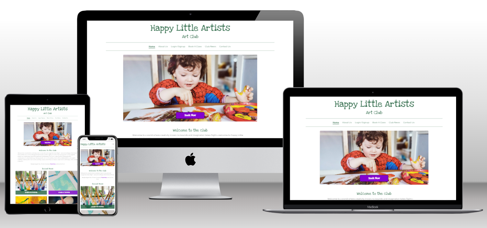
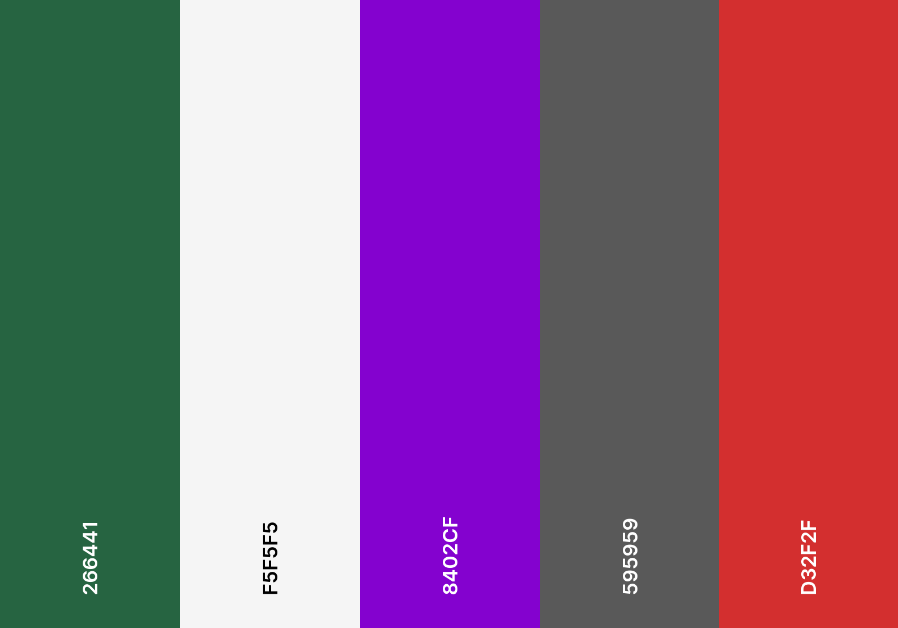
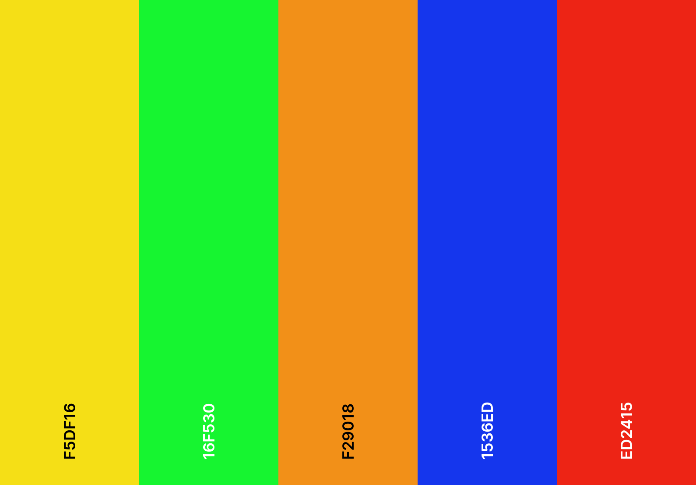
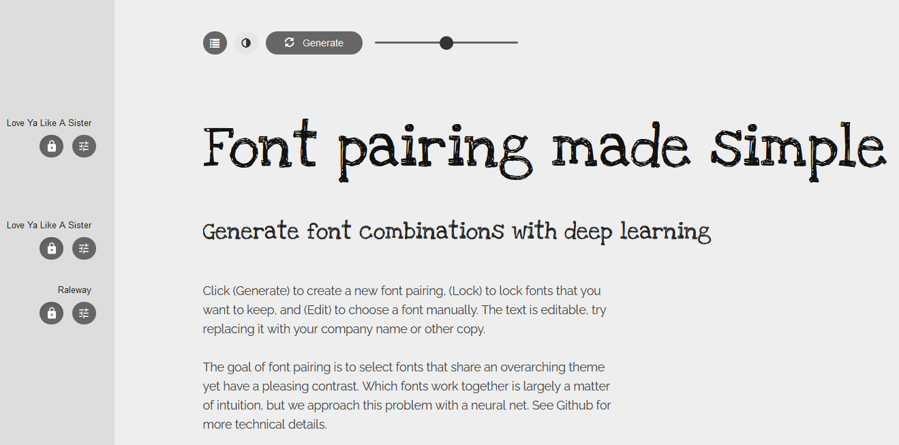

# Happy Little Artists Art Club

Happy Little Artists art club is a website designed for a local art club so its members can book classes and interact with the art club community.

[Happy Little Artists Art Club Live site](https://happy-little-artists-f3eca52b3ca8.herokuapp.com/)

# Table of Contents

1. [Introduction](#happy-little-artists-art-club)
2. [User Experience](#user-experience)
    - [Initial Discussion](#initial-discussion)
    - [User stories](#user-stories)
3. [Design](#design)
    - [Colour scheme](#colour-scheme)
    - [Typography](#typography)
    - [Wireframes](#wireframes)
    - [Database Entity relationship diagram](#database-entity-relationship-diagram)
    - [Agile Development](#agile-development)
        - [User stories and Epics](#user-stories-and-epics)
        - [Project backlog](#project-backlog)
        - [MoSCow prioritization](#moscow-prioritization)
        - [Iterations](#iterations)
        - [Information radiator (board)](#information-radiator-board)
4. [Features](#features)
    - [Header brand](#header-brand)
    - [Navigation](#navigation)
    - [Footer](#footer)
    - [Home Page](#home-page)
    - [About Us Page](#about-us-page)
    - [Sign up Page](#sign-up-page)
    - [Sign in Page](#sign-in-page)
    - [Log out Page](#log-out-page)
    - [Profile Page](#profile-page)
    - [Empty Profile](#empty-profile)
    - [Edit Info Page](#edit-info-page)
    - [Edit Profile Page](#edit-profile-page)
    - [Edit Booking Page](#edit-booking-page)
    - [Delete Booking Modal](#delete-booking-modal)
    - [Visit Users Profiles](#visit-users-profiles)
    - [Book A Class Page](#book-a-class-page)
    - [Bookings Limit](#bookings-limit)
    - [Club News Page](#club-news-page)
    - [News Post Page](#news-post-page)
    - [Contact Us Page](#contact-us-page)
    - [Messaging](#messaging)
    - [Error pages](#error-pages)
    - [Admin Panel](#admin-panel)
    - [Future Implementations](#future-implementations)
    - [Accessibility](#accessibility)
5. [Technologies used](#technologies-used)
    - [Languages](#languages)
    - [Libraries, Modules, classes imported](#libraries-modules-classes-imported)
    - [Version control](#version-control)
    - [Programs](#programs)
    - [Tools](#tools)
6. [Deployment & Local Deployment](#deployment--local-deployment)
    - [Heroku Deployment](#heroku-deployment)
    - [Local Deployment](#local-deployment)
        - [How to Fork](#how-to-fork)
        - [How to Clone](#how-to-clone)
7. [Testing](#testing)
8. [Credits](#credits)
    - [Copy](#copy)
    - [Imagery](#images)
    - [Code](#code)
    - [Acknowledgements](#acknowledgements)

# User Experience

## Initial Discussion

Happy Little Artists Art Club is a website that I (Gary Dolan) developed for my fourth project as part of Code Institutes Diploma in Full Stack Software Development. The website was designed for a local art club so its members can book classes online. The website also offers the users updates with regards to the goings on in the class via club news blog posts. User registration is available with profile pages that allow users to interact with the art club and its community.

## User stories

### Owner/Admin & Developer goals

-   As a developer I can select a colour scheme so that the websites colouring creates a positive user experience and also meets the stakeholders aesthetic goals. [#1](https://github.com/GaryDolan/ci-p4-happy-little-artists/issues/1)
-   As a developer I can select the websites fonts so that I can provide a good user experience, highlighting readability and stakeholder branding goals. [#2](https://github.com/GaryDolan/ci-p4-happy-little-artists/issues/2)
-   As a developer I can construct wire-frames so that I have details of the website layout, features and style before coding begins. [#3](https://github.com/GaryDolan/ci-p4-happy-little-artists/issues/3)
-   As a developer I can create an entity relationship diagram so that I can define all database entities, the information they will store and their relationship to one another. [#4](https://github.com/GaryDolan/ci-p4-happy-little-artists/issues/4)
-   As a Developer I can add styling to the website so that it is visually appealing to the user, easy to use and all content is accessible and readable. [#15](https://github.com/GaryDolan/ci-p4-happy-little-artists/issues/15)
-   As a Developer I can create custom error templates for common errors so that the user is provided with a safe way to return to our website if an error occurs and the website maintains a good UX. [#16](https://github.com/GaryDolan/ci-p4-happy-little-artists/issues/16)
-   As a Developer I can implement logic to limit the number of bookings a class can have so that the art class does not exceed capacity. [#46](https://github.com/GaryDolan/ci-p4-happy-little-artists/issues/46)
-   As a Developer I can add messaging to the website so that I can provide the user with feedback regarding the action they have performed. [#51](https://github.com/GaryDolan/ci-p4-happy-little-artists/issues/51)
-   As a Developer I can create a detailed readme file so that the reader can understand my development process and website functionality. [#34](https://github.com/GaryDolan/ci-p4-happy-little-artists/issues/34)
-   As a Developer I can create a detailed testing file so that the reader can understand my testing process, any issues I encountered and how I fixed those issues. [#35](https://github.com/GaryDolan/ci-p4-happy-little-artists/issues/35)
-   As a Developer I can carry out user story testing so that I can confirm the finished project meets the user story requirements. [#37](https://github.com/GaryDolan/ci-p4-happy-little-artists/issues/37)
-   As a Developer I can carry out validation of my code so that I can ensure it complies to coding guidelines. [#38](https://github.com/GaryDolan/ci-p4-happy-little-artists/issues/38)
-   As a Developer I can carry out manual site testing so that I can confirm the correct operation of the website. [#39](https://github.com/GaryDolan/ci-p4-happy-little-artists/issues/39)
-   As a Developer I can carry out lighthouse testing on all my webpages so that I can assess my websites performance and accessibility. [#40](https://github.com/GaryDolan/ci-p4-happy-little-artists/issues/40)
-   As a Developer I can carry out responsive design testing so that I can ensure my website works on a variety of screen sizes, from mobile to large desktop. [#41](https://github.com/GaryDolan/ci-p4-happy-little-artists/issues/41)
-   As a developer I can convert uploaded images to WEBP format so that my website has faster load time. [#56](https://github.com/GaryDolan/ci-p4-happy-little-artists/issues/56)
-   As an Admin I can create, read, update and delete posts so that I can add and manage news post on my website. [#18](https://github.com/GaryDolan/ci-p4-happy-little-artists/issues/18)
-   As an Admin I can mark my posts as draft when creating them so that I can save a post without publishing it to the website for completion at a later date. [#19](https://github.com/GaryDolan/ci-p4-happy-little-artists/issues/19)
-   As an Admin I can approve or reject comments so that I can filter out any inappropriate comments. [#20](https://github.com/GaryDolan/ci-p4-happy-little-artists/issues/20)
-   As an Admin I can perform crud operations on user profiles, art classes and bookings so that I can manage any inappropriate content or where applicable delete harmful users profiles and manage art classes and bookings. [#21](https://github.com/GaryDolan/ci-p4-happy-little-artists/issues/21)

### First time visitor goals

-   As a User I can navigate through the website with ease understanding layout and calls to action so that I can make use of the websites various functionality. [#12](https://github.com/GaryDolan/ci-p4-happy-little-artists/issues/12)
-   As a User I can view the website on multiple devices with different screen sizes so that I can have an excellent viewing experience regardless of the device I use. [#14](https://github.com/GaryDolan/ci-p4-happy-little-artists/issues/14)
-   As a User I can sign up and create an account so that I can login to comment on posts, like posts and make bookings. [#23](https://github.com/GaryDolan/ci-p4-happy-little-artists/issues/23)
-   As a User I can view a paginated list of articles in relation to club news so that I can choose one to read. [#28](https://github.com/GaryDolan/ci-p4-happy-little-artists/issues/28)
-   As a User I can click on a post in the list to view so that I can view full details and approved comments on a post, allowing me to read the post and the opinions of the community regarding the post. [#29](https://github.com/GaryDolan/ci-p4-happy-little-artists/issues/29)
-   As a User I can comment on a post so that I can share my opinion with regards to the post content. [#30](https://github.com/GaryDolan/ci-p4-happy-little-artists/issues/30)
-   As a User I can like and unlike posts so that I can quickly express my opinion of the post content. [#31](https://github.com/GaryDolan/ci-p4-happy-little-artists/issues/31)
-   As a User I can make a booking for an art class so that I have a note of the art classes I will be attending and I reserve my place for attending the art class. [#45](https://github.com/GaryDolan/ci-p4-happy-little-artists/issues/45)
-   As a User I can view an about us page so that I can learn all about the art club, who runs it and the classes it offers. [#49](https://github.com/GaryDolan/ci-p4-happy-little-artists/issues/49)
-   As a User I can view a home page so that I can be introduced to the club and be provided with access to booking a class or reading the club news. [#50](https://github.com/GaryDolan/ci-p4-happy-little-artists/issues/50)

### Returning visitor goals

-   As a User I can click on the art clubs social links in the footer so that I can visit the art clubs various social networks and interact with them. [#13](https://github.com/GaryDolan/ci-p4-happy-little-artists/issues/13)
-   As a User I can login so that I can access my account, view my bookings, comment and like posts etc. [#24](https://github.com/GaryDolan/ci-p4-happy-little-artists/issues/24)
-   As a User I can logout so that I can no longer access my account and associated functionality. [#25](https://github.com/GaryDolan/ci-p4-happy-little-artists/issues/25)
-   As a User I can view my profile page so that I can see my account profile content. [#43](https://github.com/GaryDolan/ci-p4-happy-little-artists/issues/43)
-   As a User I can edit my profile so that I can control my profile contents [#44](https://github.com/GaryDolan/ci-p4-happy-little-artists/issues/44)
-   As a User I can view and delete my bookings so that I can control my art class bookings. [#47](https://github.com/GaryDolan/ci-p4-happy-little-artists/issues/47)
-   As a User I can fill out a contact form so that I can communicate with the website owner directly. [#48](https://github.com/GaryDolan/ci-p4-happy-little-artists/issues/48)
-   As a User I can click the username of the commenter so that I can view their profile. [#54](https://github.com/GaryDolan/ci-p4-happy-little-artists/issues/54)

[Return to Table of Contents](#table-of-contents)

# Design

## Colour scheme

Due to the fact that this as a website for a children's art club the owner wanted to have a lot of colour throughout. I encouraged her to do this in a way that would not make the website an eyesore or too childish, as even thought the class is for children, it would be adults who use the website. As such a lot of the colour used in this website is based on user interaction with menus, brand logo etc. There were two colour schemes for the website

### Primary colour scheme

My primary colour scheme is used for the primary website features, heading, text, buttons etc.

-   #266441: This was chosen based on the colours wanted by the user. This is used for heading text, brand text, horizontal rules etc.
-   #F5F5F5: This is used for text and some backgrounds to user details and form to make them stand out on the page.
-   #8402CF: This colour was chosen for use in the buttons, as a strong stand out colour for calls to action.
-   #595959: This colour is used for large paragraphs of text to soften the text.
-   #D32F2F: This colour was used for post preview overlays at an opacity of 0.8.

### Secondary colour scheme

The purpose of the second color scheme is add colour to the website to convey its fun, artist nature without being intrusive to the user. It is used in hover animations on the header brand and nav links, as overlays for the blog post previews and as backgrounds to forms.

-   When used for the header brand hover, the colours were used as part of a gradient at an opacity of 1.
-   When used for the hover on nav links I use the colours in a set sequence that propagates into dropdown sub menus at an opacity of 0.5.
-   When used for the post preview overlays the colours are dynamically added using a cycle to add them. For overlays an opacity of 0.8 was used
-   Finally for form backgrounds an opacity range or 0.04 - 0.2 was used. This was done to ensure excellent accessibility.

All colours combinations were checked and comply to WCAG standards, tested on [Webaim](https://webaim.org/resources/contrastchecker/). I also used [Coolors](https://coolors.co/) to visualise my palette.

## Typography

When considering fonts, I used a combination of [Google fonts](https://fonts.google.com/) to research fonts, [Font joy](https://fontjoy.com/) to compare various fonts. I decided to use a font I had used on a previous project called Raleway because it was clean and elegant and offered a wide variety of weights.

The heading font was decided upon during a consultation with the client. She had previously used the Love Ya Like a Sister font and felt it added the childlike quality she wanted in the website (I agreed).

## Wireframes

All the wireframes for the website were created using the Balsamic desktop application.

### Desktops

Home

About Us

Club News

Post detailed view

Sign Up

Sign In

Profile

Edit Profile

Book a Class

Contact Us

Error pages

### Mobile

Home

About Us

Club News

Post detailed view

Sign Up

Sign In

Profile

Edit Profile

Book a Class

Contact Us

Error pages

There were some deviations from the above wireframes as the website was developed, including not using images is placed which I initially planned to and modifications to form fields. I also decided to split the user account editing into two forms, edit info and edit profile. I finally decided on a different, more centered layout for the users profile page.

## Database Entity relationship diagram

My ERD can be seen below and represents the models in my database and their relationship to one another. I have 6 models which are the User, Profile, Post, Comment, Bookings, and art Class models. Their relationships in my ERD are as follows

-   The User has a one to many (Foreign Key) relationship with Bookings, as one user can have many bookings.
-   The User has a one to one relationship with the Profile model, as one use can only have one profile.
-   The User has a one to many (Foreign Key) relationship with the Post model, as one User can have many posts
-   The User have a one to many (Foreign Key) relationship with the comment model, as one User can have many comments
-   The Post model has a one to many (Foreign Key) relationship with the comment model, as one Post can have many comments
-   The likes field in the Post model has a many to many relationship with the user modal as many users can have many likes
-   The Art Class has a one to many (Foreign Key) relationship with the Bookings model, as one art class can have many bookings.

## Agile Development

During this project the Agile development principles were used. Using these principles allowed me to prioritise flexibility and focus on client collaboration throughout the development. It allowed me to continually provide the client with new features to test, and use the provided feedback to make changes. The way in which I implemented Agile in my project is described below.

### User stories and Epics

During the project planing stage I met with the client and discussed what the functional requirements for the website would be from her point of view. During this meeting I also suggested some requirements that would be useful and after the meeting I added some more from my point of view as a developer. I used this list of functional requirements to create user stories, represented by issues on github. Any requirement that was too large to be considered a user story was labelled as an Epic and then broken down into user stories contained in that epic. From our requirements I created 8 [epics](https://github.com/GaryDolan/ci-p4-happy-little-artists/issues?q=is%3Aissue+label%3AEpic+is%3Aclosed) and some additional user stories totalling 56 user stories. When an epic was created all related user stories within that epic were referenced inside of the it.

### Project backlog

Once the user stories were analysed and approved for inclusion in the project, they were moved to the product backlog. This is represented by a milestone with no completion date in github. Once the user stories were assigned to the backlog they were given tasks, that needed to be undertaken to complete them and pass criteria, which needed to be met for them to be considered complete.

### MoSCoW prioritization

All user stories in backlog they were given github labels based on the MoSCow prioritization technique. They were given one of four labels, "Must-Have", "Should-Have", "Could-Have" or "Wont have". This was decided upon in another consultation with the client and allowed me to prioritise user stories that were Must-Haves first. The MoSCow technique is dynamic in nature and thus allows for the labels on user stories to be changed if they become less or more important during the iterations. During the development of the website the client requested that I no longer include the feature that would allow users to delete their profile and because of the flexible nature of agile this was simply relabelled from a Could-Have to a Wont-Have and removed from the backlog.

### Story points

Once the user stories are labelled according to MoSCoW, they are the assigned story points (github label) based on fibonacci sequence. Story points allowed me to estimate the relative complexity of the user stories. Each story was assigned a label of 1,2,3,5,8 or 13 depending on its complexity relative to one another. This allows a team or in my case solo velocity to be ascertained for an iteration, which aids in the planning of the next iteration. The fibonacci sequence is used because it is a non linear scale and the idea is that it highlights the uncertainty in estimating larger tasks.

### Iterations

Once all user stories are prioritised and given story points it is time to add them to an iteration. Iterations are represented by milestones with a fixed end date in github. The idea is to add a certain number of user stories to an iteration so that the sum of the user stories story points matches the team velocity (solo in my case). I decided to create 4 [iterations](https://github.com/GaryDolan/ci-p4-happy-little-artists/milestones?state=closed), each of which would be one week long. Due to the fact that I did not have a known velocity I simply totalled the story points of all user stories and divided by four. This would mean that if for each iteration, I could attain a velocity equal to one quarter of the total story points I would complete them all in the available iterations. Once an iteration reached its close date all incomplete tasks were moved back to the product backlog for refinement into the next iteration.

### Information radiator (board)

To aid in keeping track of the status of the user stories in each iteration I created four [board information radiators](https://github.com/GaryDolan/ci-p4-happy-little-artists/projects?query=is%3Aclosed) one for each iteration, these are represented by github projects. Each board had 4 sections, Todo, In progress, Done and Project backlog. At the start of each iteration the user stories to be completed in that iteration were moved to the ToDo section of the board. As I worked on and completed tasks they were moved to in progress and finally done. The project backlog was included so that I could dynamically adjust the iteration as the need arose, returning downgraded user stories to it or taking stories from the backlog to add to an iteration.

[Return to Table of Contents](#table-of-contents)

# Features

Below is a explanation of the features of the Website. All elements of the website are fully responsive across all pages from 320px up, taking advantage of bootstrap and media queries to achieve this. For the screenshots in this section the screens were zoomed out to try capture the entire page where possible, this is so that the reader could get a better idea regarding the page layout and content. Due to the fact that it is harder to capture the entire page on mobile phone screens I have lengthened the screen size on mobile to try capture as much as possible.

## Header brand

The header brand is one of the elements that is common to all pages. By default is is the same green as all other headings. As discussed earlier it was important to the client that there was colour present in a non invasive way and some of this is evident in the header brand. The brand acts as a home button and when hovered over it will increase in size and change to a rainbow gradient. This can be seen on in the images below for both mobile and desktop.

### Mobile

### Desktop

## Navigation

The website navigation is also common to all pages of the website, it is simple, intuitive and easy to use. The page the user is currently viewing is highlighted by an underscore under the corresponding page name in the nav bar and will dynamically change as the user moves through its various pages. The navigation is another place I decided to introduce some colour. To keep the styling consistent I used the same rainbow colours that were used in the header brand but at a lower opacity to ensure excellent readability and ensure high accessibility. Each nav link in the nav bar will change to a different colour as the user hovers over it and this is true of sub menus in the dropdown as well.

### Mobile

### Desktop

### Desktop(logged in)

## Footer

The footer is another item which is common to all pages in the website. When initially meeting the client, I showed her some of my previous work and she seemed to like the idea of a simple footer with just social media links in it via icons. As you may have guessed by now she wanted some colour in that too, so each icon is coloured according to its branding. When hovered over the icons will increase in size and brightness to supply the user with feedback to indicate to the user that they are clickable (this is a common idea throughout the website). If any of the social network icons are clicked it will bring the user to the relevant one for the club (opened in a new tab). At the moment the club only has a facebook and instagram so some of the buttons lead to the websites homepage.

### Mobile

### Desktop

## Home Page

The homepage of the websites tries to accomplish the two main tasks of the site immediately, which is to get the user to book an art class and to keep the user engaged within the art class community. The user is met with a hero image on the homepage, a picture of my son Jake enthralled in his messy, very fun art play. I choose this image to immediately try to convey the idea behind the club, which is to have fun doing and fall in love with art. Overlayed on top of the image is a book now button which will direct the users to the book a class page when pressed or the log in page if not logged in. Just under the hero image is a brief welcome message, which again contains a book now link but one that is much more subtile way, so as not to push the idea too strongly on the user. The final section of the homepage is a recent news section, which presents the user with the 4 most recent post that have been added to the club news section of the website. This ensures that if apprehensive about booking with the club the user can visit the posts to see what goes on behind the scenes. It also give returning users immediate access to the latest happenings in the club.

### Mobile

### Desktop

## About Us Page

The about us page is a simple informational page which gives the user information regarding the club, its teacher and the class structure. It also contains find us section with a google map interface. Throughout the about us page text, various links are subtly placed to again prompt the user to book a class.

### Mobile

### Desktop

## Sign up Page

This page allows the user to create a new account. The page contains a form with fields for username, email, password and password again, followed by a sign up button. Once filled out correctly and the button is pressed the users new account and profile will be created and the user will be redirected to the home page. The sign up page also contains a link for sign in incase the user already has an account.

### Mobile

### Desktop

## Sign in Page

This page allows the user to log into their account. The page contains a form with fields for username and password , followed by a sign in button. Once filled out correctly and the button is pressed the users will be logged in and redirected to the home page. The sign up page also contains a link for sign up incase the user does not already have an account.

### Mobile

### Desktop

## Log out Page

This page allows the user to log out of their account. The page contains a message asking the user to confirm the sign out, followed by a sign out button. Once the button is pressed the users will be logged out and redirected to the home page.

### Mobile

### Desktop

## Profile Page

The profile page contains the following,

-   Profile picture
    This is a simple framed, circular profile image, chosen by the user. A placeholder image will initially be used until the user uploads an image.
-   User info
    This contains the users first name, last name, date they became a member and a button to edit the info.
-   About me section
    This contains the users about me section and a button to edit the profile.
-   My bookings
    On mobile this contains cards which are populated with the users bookings, with newest bookings shown first. Its shows details such as the child's name, age group, the booking start and end dates (10 classes per booking), the class start time each week, class length, class location and the payment status. On desktop it contains a table which is populated with the same information. Both the cards and the table also contain icons which the user can press to edit or delete their bookings. Again the edit and delete buttons provide feedback to the user in the form of a brightness increase when hovered.
-   My liked posts
    This contains a paginated list of all the users liked posts. All posts in the list can be clicked to view the post and provide feedback to the user on hover.

### Mobile

### Desktop

## Empty profile

When a profile does not contain content, the location of the content will be replaced with text and buttons prompting the user to update their information, book a class or visit the club news section. The buttons are removed and text changed if an empty profile is viewed by a user that does not own it.

### Mobile

#### Profile owner view

#### Profile non-owner view

### Desktop

#### Profile owner view

#### Profile non-owner view

## Edit Info Page

When the edit your info button is pressed from the users profile the edit info form is shown. This form contains the fields first name, last name and email. All fields must be completed correctly for the form to be submitted and all fields contain, help text and validation. All the fields will be prepopulated with the users current info and can be edited by the user. The form contains a button to update the users info which will update the information and redirect the user to their profile page.

### Mobile

### Desktop

## Edit Profile Page

When the edit your profile button is pressed from the users profile the edit profile form is shown. This form contains the a button to update the users profile image and a textfield for the users to edit their about me section. All the fields will be prepopulated with the users current info and can be edited by the user. The form contains a button to update the users info which will update the information and redirect the user to their profile page.

### Mobile

### Desktop

## Edit Booking Page

When the edit booking icon is pressed from the users profile the edit booking form is shown. This form contains fields for the art class selection (selection of available classes) the child's name, a contact number, an emergency contact name and emergency contact number. All the fields will be prepopulated with the users current info and can be edited by the user. The form contains a button to update the booking which will update the booking and redirect the user to their profile page.

### Mobile

### Desktop

## Delete Booking Modal

When the delete booking icon is pressed from the profile page the user will be presented with the delete booking modal asking them to confirm the booking deletion. Once the user confirms the deletion they will be redirected to their profile page and the booking will be deleted.

### Mobile

### Desktop

## Visit Users Profiles

Users can visit each others profiles by clicking on the username in any comment that the user has left. When visiting another users profile no info will be shown regarding the users booking and no interactivity to edit or change anything will be available. The interactivity such as editing info and bookings is removed on the front end and protection is added to the functionality on the back end to ensure no interaction with a users profile is possible unless the user viewing the profile is the owner themselves and they are logged in.

### Mobile

### Desktop

## Book A Class Page

The book a class page consists of a brief explanation of the art classes and a form that allows a user to make an art class booking for their child. The form contains a field for art class selection. This is a dropdown containing all the art classes created by the admin in the backend, which still have available space (20 places per class). It also contains fields for child's name, a contact number, and emergency contact and an emergency contact number. All fields contain custom validation and help text. When the form is filled out correctly it can be submitted using the create booking button at the end of the form. Once pressed the booking will be created and the user will be redirected to their profile page where they can immediately see details of the booking. Due to the fact that each booking is made for a particular class set and the class terms are months apart, I decided that the user should fill out the information each time and that I would not save the information and prepopulated the form. This would ensure the information is correct and up to date for each booking. Bookings made may also be for different children or have different emergency contacts or numbers and due to this if I prepopulated the fields the user may have to delete the data before filling out the form, which would lead to bad UX.

### Mobile

### Desktop

## Bookings Limit

A booking limit feature has been added to the art classes on the website. This will remove classes from the dropdown list of available classes on the book a class form when they are full (20 booking reached). If for any reason all classes have been filled the art class form field will be disabled and custom HTML will be injected into the form label and help text to inform the user of this. The form can no longer be submitted an user will be asked to try again later.

### Mobile

### Desktop

## Club News Page

The club news page consists of some brief club news text followed by a list of paginated club posts previews, showing 4 posts previews per page. The post previews were another opportunity to add colour to the website in the form of an opaque overlay which contains the post title and in the case of the most recent post its description text. As the posts previews are rendered dynamically, the overlays will rotate through a list of four colours applying them dynamically to each preview. All post previews have feedback in the form of a size change and brightness increase when hovered over. When a post preview is clicked it will direct the user to the selected posts detailed view.

### Mobile

### Desktop

## News Post Page

The post detail page consists of the following,

-   The posts title and text content.
-   The post featured image and up to 5 additional secondary images.
    These images provide feedback indicating they can be clicked and when clicked the images will be displayed using lightbox2's gallery feature. This ties all the images on the page into a gallery and supplies next, back and X icons so the user can easily browse through the images or close them.
-   Text regarding the post creation.
-   Current like and comment count, along with a clickable like icon.
    The like icon can be clicked by a logged in user. When clicked it will add a like to the post and the page will be reloaded informing the user that they have liked the post. The like icon will now appear solid to the user to indicate that they have liked the post and the post count will have increased. The user can undo this process by clicking the like icon again.
-   A text field to allow users to leave a comment if logged in.
    This field is only viewable to logged in users and will allow the user to enter and submit a comment. Once submitted the user will be informed there comment has been submitted for approval and the comment field will be removed.
-   User comments for the post.
    This shows all approved comments made by all users on this post. Each comment contains the comment text, the username of the user who made the comment and the time and date of the comment. The username is a clickable link which provided feedback and displays the corresponding users profile when pressed.

### Mobile

### Desktop

## Contact Us Page

The contact use page consists of a form with three fields, which are name, email and message. This form lets users (regardless of login status) send a message directly to the art clubs email address. If the user is logged in the name and email address field will be populated with the data from their user account. Email is optional when signing up so this will only be populated if the user has updated this on their profile info. This ensure good UX as the user will never be asked to enter info which they have already provided us with. The form contains validation and help text and a button for sending the email. Once the form has been filled out correctly and the send button is pressed, an email will be sent to the club gmail account using the django send mail functionality. The user will be redirected to the home page an a message will be displayed informing them that their message has been received.

### Mobile

### Desktop

## Messaging

Messaging has been added to the website for all user interactions. The messages are displayed at the top of the page just under the navigation. Messages are coloured green for a positive action, orange for a less desireable action and red to indicate an error. Messages are shown for,

-   Account creation
-   Sign in
-   Log out
-   Adding a comment
-   Liking a post
-   Unliking a post
-   Creating a booking
-   Updating a booking
-   Deleting a booking
-   Message is sent from the contact us page
-   Message is not sent correctly from the contact us page
-   Invalid form submission
-   Updating their profile
-   Updating their info
-   Error messages will also be shown if a user accesses website functionality such as sending comments when not logged in.

### Mobile

### Desktop

## Error Pages

Error pages were created for the most common website errors, 400, 401, 403, 404, 500 and 503. Each page has full header and footer functionality, an explanation of the error that occurred and a home button to allow the user to easily return to a safe page.

### Mobile

### Desktop

## Admin Panel

The admin panel has been configured for superuser use, to perform CRUD functionality on all elements of the website. Admins can also carry out tasks such as publishing or archiving posts, and modifying the status of comments and the payment status of bookings. It also serves the purpose of post creation and art class creation. During a post creation any images uploaded are automatically converted to webp format and uploaded at 75% quality to ensure they do not effect website performance.

## Future Implementations

In the future I would like to add the following features to the website,

-   Front end creation of art classes and posts for super users.
-   Front end approval of comments via a tab for all pending comments.
-   Functionality to share posts
-   Edit and delete comments
-   Tagging other users by their username.
-   Gallery for each user, attached to their profile so they can add their children's art work etc.
-   Profanity filter so that comments would no longer need approval and could be censored if inappropriate.
-   Direct messaging (user to user)
-   Payment system so art classes could be paid for on the website.
-   Integrated shopping platform to sell club related merchandise.
-   Forward and back buttons to navigate between post detailed views.
-   Search functionality.
-   Emoji use in the comment forms.
-   Delete profile functionality.
-   Children models which users could save and quickly select when making a booking.
-   Single sign in using social media.
-   Required email for registration and email verification.
-   Email confirmations of class bookings, reminders for class payment and upcoming classes.
-   Password reset functionality
-   Expand my booking section to be more detailed showing each individual class session within a booking.
-   Booking via a class selection, class selection would contain more details about the class.
-   Club reviews.

## Accessibility

I was conscious of accessibility throughout the entire website development process and took the following steps to ensure that the website would be as accessible as possible.

-   Used as much semantic HTML as possible, where relevant.
-   Choose the website colours carefully ensuring I used colours that were compliant to the highest standards and provided excellent contrast.
-   Used alt attributes and aria labels where applicable.
-   Used titles where applicable to give the user hints as to what the elements around the page mean and what functions they have.
-   Used placeholder text on input to ensure user knew what the purpose of the input was.

[Return to Table of Contents](#table-of-contents)

# Technologies used

## Languages

-   Python - Used to implement server side logic and interact with DB.
-   HTML - Used to structure and create pages (templates) for the website, defining its content.
-   CSS - Used to style the websites HTML content.
-   Javascript - Used to dynamic behavior to the website.

## Frameworks

-   Django - Used to implement the model view controller architectural pattern.
-   Bootstrap - Use for front end development focused on responsive design.

## Libraries, Modules, Classes imported

-   [Lightbox 2](https://lokeshdhakar.com/projects/lightbox2/)- Used for gallery style display of post images.
-   [Cloudinary](https://pypi.org/project/cloudinary/) - Used to manage and serve static files and images.
-   [dj3-cloudinary-storage](https://pypi.org/project/dj3-cloudinary-storage/) - Used as a storage backend for Django.
-   [dj-database-url](https://pypi.org/project/dj-database-url/) - Used for parsing database URLs.
-   [django-allauth](https://pypi.org/project/django-allauth/) - Used for user authentication.
-   [django-crispy-forms](https://pypi.org/project/django-crispy-forms/) - Used for rendering Django forms with bootstrap styles.
-   [django-resized](https://pypi.org/project/django-resized/) - Used to resize and reformat uploaded images.
-   [django-summernote](https://pypi.org/project/django-summernote/) - Used to integrate summernote editor in post creation.
-   [gunicorn](https://pypi.org/project/gunicorn/) - Used as a WSGI server for running Django applications.
-   [psycopg2](https://pypi.org/project/psycopg2/) - Used as a PostgreSQL adapter for Django databases

## Version control

-   Git commands - Used via VS code terminal.
-   Github.com. - Repository created using [code institute student template](https://github.com/Code-Institute-Org/ci-full-template)
-   Github desktop - Used as a local visual aid between pushing to master. It offers a clean view of all code changes since last commit, commit history etc.

## Programs

-   Microsoft Visual Studio Code
-   Notepad ++
-   Balsamiq desktop for creation of wireframes

## Tools

-   [Lucid Chart](https://www.lucidchart.com/) was used to create the ERD.
-   [Coolors](https://coolors.co/) was used to visualise colour palettes.
-   [Google chrome eyedropper extension](https://eyedropper.org/) was used to get hex code colours.
-   [Webaim](https://webaim.org/resources/contrastchecker/) was used to ensure colour palette is compliant.
-   [Google fonts](https://fonts.google.com/) was used to research and import fonts.
-   [Font joy](https://fontjoy.com/) was used to compare various fonts.
-   [Font awesome](https://fontawesome.com/) was used to import font icons.
-   [Pixabay](https://pixabay.com) was used as a source for images.
-   [Pexels](https://www.pexels.com) was used as a source for images.
-   Google and firefox build in dev tools user to test and examine code.
-   [Wave add on](https://addons.mozilla.org/en-US/firefox/addon/wave-accessibility-tool/?utm_source=addons.mozilla.org&utm_medium=referral&utm_content=search) to check code accessibility.
-   [Techsini](https://techsini.com/multi-mockup/index.php) for responsive design image generation.
-   [Ignore x-frame headers chrome extension](https://chromewebstore.google.com/detail/ignore-x-frame-headers/gleekbfjekiniecknbkamfmkohkpodhe) to allow me to capture a responsive image using Techsini.
-   [Diff checker](https://www.diffchecker.com/) to compare code after I made changes.
-   [Favicon convertor](https://favicon.io/favicon-converter/) used to make an icon from an image.
-   [Birme](https://www.birme.net) was used to change image formats and resize images.
-   [Tiny png](https://tinypng.com/) to compress images.
-   [Google](https://www.google.ie/), [Youtube](https://www.youtube.com/), [Stack overflow](https://stackoverflow.com) and [wW3schools](https://www.w3schools.com) were used throughout the website development to help solve issues when stuck etc.
-   [Google Lighthouse](https://developer.chrome.com/docs/lighthouse/overview/) used to test the websites performance, accessibility etc.
-   [W3C CSS validator](https://jigsaw.w3.org/css-validator/) used to validate the CSS code.
-   [W3C HTML validator](https://validator.w3.org/nu/) used to validate the HTML code.
-   [Ci python Linter](https://pep8ci.herokuapp.com/#) to validate Python code.
-   [JShint](https://jshint.com/) to validate JavaScript code.
-   [Django secret key generator](https://miniwebtool.com/django-secret-key-generator/)

[Return to Table of Contents](#table-of-contents)

# Deployment & Local Deployment

## Heroku Deployment

The following must be carried out before deployment to Heroku.

1. A Procfile must be created and used to configure gunicorn server (web: gunicorn main.wsgi).
2. The requirements.txt must be populated with a list of dependencies that the project needs to run. This can be done using the terminal command pip3 freeze > requirements.txt.

This application was deployed on Heroku using the following steps,

1. Create a Heroku account and log in.
2. Select create new app from the dashboard.
3. Enter a name for the app, select a region and press create app.
4. From the app homepage select settings.
5. Select reveal config vars.
6. Add a config var with a key or PORT and a value of 8000 and any other var from your local .env file.
7. Select the deploy section from the app homepage.
8. Select Github as the deployment method and connect to Github.
9. In the search bar, enter the name of the repo used for the app and click search.
10. Press connect to link the Heroku app to the repo.
11. Deploy using automatic or manual deployment options at the bottom of the deploy section.

## Local Deployment

### How to Fork

To fork this repository,

1. Log into or signup at [Github](https://github.com).
2. Select the repository for this website.
3. Click the fork button (upper right).

### How to Clone

To clone this repository,

1. Log into or signup at [Github](https://github.com).
2. Select the repository for this website
3. Click the green code button (upper right).
4. Copy the URL using the copy button.
5. Open the terminal in your editor (or of your choosing) and move to the directory which you want to clone to.
6. Type git clone and paste the repository link, then press enter.

[Return to Table of Contents](#table-of-contents)

# Testing

For comprehensive details regarding testing and bugs found, please refer to [TESTING.md](TESTING.md)

# Credits

## Copy

Website copy was written by myself with assistance from chat GPT.

## Images

-   [Crayon image](https://www.pexels.com/photo/white-crayon-box-399670/) by [freestocks.org](https://www.pexels.com/@freestocks/)
-   [Abstract painting](https://www.pexels.com/photo/abstract-painting-and-paintbrushes-with-acrylic-paint-on-white-surface-7111169/) by [Tara Winstead](https://www.pexels.com/@tara-winstead/)
-   [Sunset painting](https://www.pexels.com/photo/yellow-and-red-painting-2013663/) by [Juris Freidenfelds](https://www.pexels.com/@juris-freidenfelds-927897/)
-   [Brushes picture](https://www.pexels.com/photo/shallow-photography-of-brushes-on-jar-1084406/) by [Em Hopper](https://www.pexels.com/@empowerhaus/)
-   [Child painting](https://www.pexels.com/photo/child-painting-a-canvas-with-red-paint-6964722/) by [Anastasia Shuraeva](https://www.pexels.com/@anastasia-shuraeva/)
-   [Color pallet](https://www.pexels.com/photo/a-paint-brush-on-a-coloring-palet-6966324/) by [Anastasia Shuraeva](https://www.pexels.com/@anastasia-shuraeva/)
-   [Paint brushes in jar](https://www.pexels.com/photo/pain-brushes-inside-clear-plastic-cups-542556/) by [Jadson Thomas](https://www.pexels.com/@jadson-thomas-164235/)
-   [Pens and paint](https://www.pexels.com/photo/three-pens-2208557/) by [Dominika Roseclay](https://www.pexels.com/@punchbrandstock/)
-   [Coloured paper](https://www.pexels.com/photo/close-up-photography-of-different-type-of-colors-of-paper-40799/) by [Pixabay](https://www.pexels.com/@pixabay/)
-   [Child's drawing](https://pixabay.com/photos/childrens-drawings-coloring-town-716340/) by [jackmac34](https://pixabay.com/users/jackmac34-483877/)
-   [Drawing crayon](https://pixabay.com/photos/drawing-crayon-graffiti-child-2009815/) by [marimari1101](https://pixabay.com/users/marimari1101-4367124/)
-   [Flower](https://pixabay.com/photos/flower-nature-plant-petal-garden-3313905/) by [sihrevano](https://pixabay.com/users/sihrevano-6848033/)
-   [Landscape](https://pixabay.com/photos/tree-sunset-nature-dawn-landscape-3072431/) by [jplenio](https://pixabay.com/users/jplenio-7645255/)
-   [Dog](https://pixabay.com/photos/puppy-golden-retriever-dog-young-1207816/) by [Chiemsee2024](https://pixabay.com/users/chiemsee2024-1892688/)
-   [Child Drawing](https://pixabay.com/photos/drawing-child-plasticity-talent-428383/) by [jarmoluk](https://pixabay.com/users/jarmoluk-143740/)
-   [Class chair](https://www.pexels.com/photo/brown-wooden-table-with-chairs-upside-down-8535620/) by [Ksenia Chernaya](https://www.pexels.com/@kseniachernaya/)
-   [Classroom](https://www.pexels.com/photo/an-empty-classroom-8535634/) by [Ksenia Chernaya](https://www.pexels.com/@kseniachernaya/)
-   [Rainow colours](https://www.pexels.com/photo/close-up-photo-of-rainbow-colors-4219312/) by [Alexander Grey](https://www.pexels.com/@mccutcheon/)
-   [Yellow painting](https://www.pexels.com/photo/multi-coloured-abstract-painting-1372990/) by [Steve Johnson](https://www.pexels.com/@steve/)
-   [Blue painting](https://www.pexels.com/photo/blue-and-red-abstract-painting-1799912/) by [Steve Johnson](https://www.pexels.com/@steve/)
-   [Art matrials](https://www.pexels.com/photo/close-up-shot-of-art-materials-on-a-blue-surface-6978731/) by [Anastasia Shuraeva](https://www.pexels.com/@anastasia-shuraeva/)
-   [Arm painting](https://www.pexels.com/photo/close-up-of-arm-painting-8535194/) by [Ksenia Chernaya](https://www.pexels.com/@kseniachernaya/)
-   [Boy drawing](https://www.pexels.com/photo/unrecognizable-ethnic-boy-drawing-on-paper-near-friend-5745522/) by [Ryutaro Tsukata](https://www.pexels.com/@ryutaro/)
-   [Colourful drawing](https://www.pexels.com/photo/crop-child-drawing-colorful-picture-on-paper-5622347/) by [Allan Mas](https://www.pexels.com/@allan-mas/)
-   [Class setup](https://www.pexels.com/photo/photo-of-empty-classroom-8088235/) by [Artem Podrez](https://www.pexels.com/@artempodrez/)
-   [Blank profile picture](https://pixabay.com/vectors/blank-profile-picture-mystery-man-973460/) by [WandererCreative](https://pixabay.com/users/wanderercreative-855399/)
-   [Favicon image](https://pixabay.com/vectors/icon-palette-painting-art-cutout-6488329/) by [Tripolosky](https://pixabay.com/users/tripolosky-22625434/)
-   [Art supplies](https://pixabay.com/photos/art-supplies-art-school-supplies-957576/) by [ElissaCapelleVaughn](https://pixabay.com/users/elissacapellevaughn-1166168/)

## Code

Below I have listed all the sources which I learned from or that helped me solve an issue during the project development.

-   Learned about securing views [here](https://www.codu.co/articles/securing-django-views-from-unauthorized-access-npyb3to_).
-   Learned about resizing images and converting formats [here](https://stackoverflow.com/questions/72885136/django-convert-image-to-webp).
-   Learned about instagrams gradient colours [here](https://stackoverflow.com/questions/37751375/instagram-new-logo-css-background).
-   Learned about dynamically adding classes to HTML in Django [here](https://stackoverflow.com/questions/31263328/how-to-add-html-classes-to-a-django-template-for-loop-dynamically).
-   Learned about creating a numeric for loop [here](https://stackoverflow.com/questions/1107737/numeric-for-loop-in-django-templates).(althought not implemented).
-   Learned about solving template syntax error expected at least on assignment [here](https://stackoverflow.com/questions/36231619/templatesyntaxerror-with-expected-with-atleast-one-variable-assignment).
-   Learned about using slugify to auto update slug field [here](https://stackoverflow.com/questions/58621941/auto-update-slug-field-in-updateview).
-   Learned about creating pagination [here](https://www.youtube.com/watch?v=N-PB-HMFmdo) and [here](https://www.youtube.com/watch?v=wY_BNsxCEi4).
-   Learned about the Django delete view [here](https://www.youtube.com/watch?v=nFa3lC105dM&list=PLXuTq6OsqZjbCSfiLNb2f1FOs8viArjWy&index=14).
-   Learned about overriding the delete method on a model [here](https://stackoverflow.com/questions/1534986/how-do-i-override-delete-on-a-model-and-have-it-still-work-with-related-delete).
-   Learned about creating custom Regexvalidator [here](https://www.youtube.com/watch?v=FY9W3MN8jBQ).
-   Learned about comparing two django model fields [here](https://stackoverflow.com/questions/12380448/how-to-create-a-django-queryset-filter-comparing-two-date-fields-in-the-same-mod).
-   Learned about modifying a Django model field using widget [here](https://stackoverflow.com/questions/68736684/modify-django-model-form-field-with-widget).
-   Learned about using mark_safe to add html to a django form field [here](https://stackoverflow.com/questions/10706296/how-do-i-input-html-into-the-help-text-of-a-django-form-field).
-   Learned about creating queries with multiple conditions [here](https://stackoverflow.com/questions/50895730/django-q-object-query-filtering-with-multiple-conditions-failing).
-   Learned about specifying a Django version for Heroku deployment [here](https://devcenter.heroku.com/articles/python-runtimes).
-   Learned about send mail error unexpected keyword [here](https://stackoverflow.com/questions/77482831/smtp-starttls-got-an-unexpected-keyword-argument-keyfile).

## Acknowledgements

I would like to acknowledge the following people for support and guidance during this project,

-   My Mentor Daisy Mc Girr for advice before and during this project.
-   Our Cohort Facilitator Alan Bushell and Fellow students, for their participation on slack via comments, questions and discussions during our weekly meetings, all of which gave further understanding and insight into the course content.

[Return to Table of Contents](#table-of-contents)
