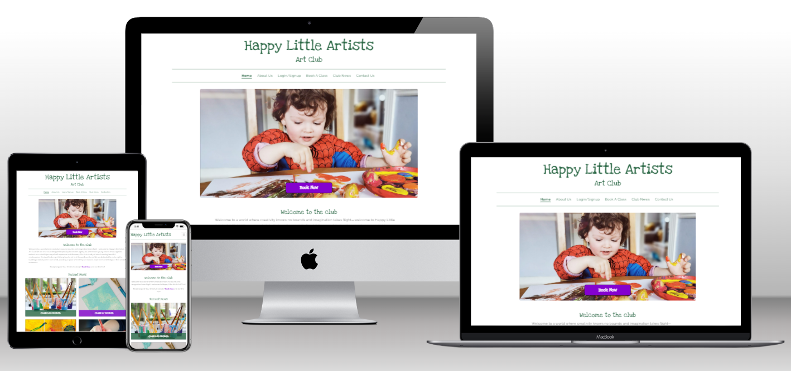

# Happy Little Artists Art Club

Testing of app was ongoing throughout the development process. I used the developer tools in chrome and firefox to test all aspect of the app.

# Table of Contents

-   [User story testing](#user-story-testing)
    -   [Owner/Admin & Developer goals](#owneradmin--developer-goals)
    -   [First time visitor goals](#first-time-visitor-goals)
    -   [Returning visitor goals](#returning-visitor-goals)
-   [Automated testing](#automated-testing)
    -   [Python](#python)
    -   [HTML](#html)
    -   [CSS](#css)
    -   [JavaScript](#javascript)
-   [Lighthouse testing](#lighthouse-testing)
-   [Manual testing](#manual-testing)
    -   [Header brand](#header-brand)
    -   [Navigation](#navigation)
    -   [Footer](#footer)
    -   [Home Page](#home-page)
    -   [About Us Page](#about-us-page)
    -   [Sign up Page](#sign-up-page)
    -   [Sign in Page](#sign-in-page)
    -   [Log out Page](#log-out-page)
    -   [Profile Page](#profile-page)
    -   [Empty Profile](#empty-profile)
    -   [Edit Info Page](#edit-info-page)
    -   [Edit Profile Page](#edit-profile-page)
    -   [Edit Booking Page](#edit-booking-page)
    -   [Delete Booking Modal](#delete-booking-modal)
    -   [Visit Users Profiles](#visit-users-profiles)
    -   [Book A Class Page](#book-a-class-page)
    -   [Club News Page](#club-news-page)
    -   [News Post Page](#news-post-page)
    -   [Contact Us Page](#contact-us-page)
    -   [Error pages](#error-pages)
-   [Responsive design testing](#responsive-design-testing)
-   [Bugs](#bugs)

# User story testing

# Owner/Admin & Developer goals

Results

| Test                                                                                                                                                                                               | Expected Result                                                                                | Pass     |
| -------------------------------------------------------------------------------------------------------------------------------------------------------------------------------------------------- | ---------------------------------------------------------------------------------------------- | -------- |
| As a developer I can select a colour scheme so that the websites colouring creates a positive user experience and also meets the stakeholders aesthetic goals.                                     | Colour scheme created in line with user story                                                  | &#10004; |
| As a developer I can select the websites fonts so that I can provide a good user experience, highlighting readability and stakeholder branding goals.                                              | Fonts selected in line with user story                                                         | &#10004; |
| As a developer I can construct wire-frames so that I have details of the website layout, features and style before coding begins.                                                                  | Wireframes constructed before coding began                                                     | &#10004; |
| As a developer I can create an entity relationship diagram so that I can define all database entities, the information they will store and their relationship to one another.                      | ERD created detailing all models and relationships                                             | &#10004; |
| As a Developer I can add styling to the website so that it is visually appealing to the user, easy to use and all content is accessible and readable.                                              | Styled to be visually appealing and has high accessibility scores site wide                    | &#10004; |
| As a Developer I can create custom error templates for common errors so that the user is provided with a safe way to return to our website if an error occurs and the website maintains a good UX. | Error templates created for 400, 401, 403, 404, 500 and 503                                    | &#10004; |
| As a Developer I can implement logic to limit the number of bookings a class can have so that the art class does not exceed capacity.                                                              | Logic working correctly to limit number of bookings per class to max bookings (defaults to 20) | &#10004; |
| As a Developer I can add messaging to the website so that I can provide the user with feedback regarding the action they have performed.                                                           | Messaging shown for all user interaction with the website                                      | &#10004; |
| As a Developer I can create a detailed readme file so that the reader can understand my development process and website functionality.                                                             | Detailed [readme](README.md) created                                                           | &#10004; |
| As a Developer I can create a detailed testing file so that the reader can understand my testing process, any issues I encountered and how I fixed those issues.                                   | Detailed testing file created                                                                  | &#10004; |
| As a Developer I can carry out user story testing so that I can confirm the finished project meets the user story requirements.                                                                    | Story testing completed successfully                                                           | &#10004; |
| As a Developer I can carry out validation of my code so that I can ensure it complies to coding guidelines.                                                                                        | All validation carried out                                                                     | &#10004; |
| As a Developer I can carry out manual site testing so that I can confirm the correct operation of the website.                                                                                     | Manual testing complete and documented                                                         | &#10004; |
| As a Developer I can carry out lighthouse testing on all my webpages so that I can assess my websites performance and accessibility.                                                               | Lighthouse testing complete with excelling scores                                              | &#10004; |
| As a Developer I can carry out responsive design testing so that I can ensure my website works on a variety of screen sizes, from mobile to large desktop.                                         | Responsive testing complete-no issues found                                                    | &#10004; |
| As a developer I can convert uploaded images to WEBP format so that my website has faster load time.                                                                                               | Django resized library used to upload post images in webp format at 75% quality                | &#10004; |
| As an Admin I can create, read, update and delete posts so that I can add and manage news post on my website.                                                                                      | Full crud functionality available from admin panel                                             | &#10004; |
| As an Admin I can mark my posts as draft when creating them so that I can save a post without publishing it to the website for completion at a later date.                                         | Posts can be marked as drafts as well as archived                                              | &#10004; |
| As an Admin I can approve or reject comments so that I can filter out any inappropriate comments.                                                                                                  | Comment approval or rejection fully functional                                                 | &#10004; |
| As an Admin I can perform crud on user profiles, art classes and bookings so that I can manage any inappropriate content or where applicable delete harmful users profiles.                        | Admin panel provides full crud functionality for all user models                               | &#10004; |

# First time visitor goals

Results

| Test                                                                                                                                                                | Expected Result                                                                              | Pass     |
| ------------------------------------------------------------------------------------------------------------------------------------------------------------------- | -------------------------------------------------------------------------------------------- | -------- |
| As a User I can navigate through the website with ease understanding layout and calls to action so that I can make use of the websites various functionality.       | Easy to use responsive navbar implemented. Uniform calls to action used site wide            | &#10004; |
| As a User I can view the website on multiple devices with different screen sizes so that I can have an excellent viewing experience regardless of the device I use. | Website is fully responsive from 320px up.                                                   | &#10004; |
| As a User I can sign up and create an account so that I can login to comment on posts, like posts and make bookings.                                                | Sign in via allauth implemented as well as post commenting, liking posts and booking classes | &#10004; |
| As a User I can view a paginated list of articles in relation to club news so that I can choose one to read.                                                        | Club news implemented providing a paginated list of all club posts                           | &#10004; |
| As a User I can click on a post in the list to view so that I can view full details and approved comments on a post                                                 | Clicking any club news post will bring the user to the related news article                  | &#10004; |
| As a User I can comment on a post so that I can share my opinion with regards to the post content.                                                                  | Post commenting has been implemented                                                         | &#10004; |
| As a User I can like and unlike posts so that I can quickly express my opinion of the post content.                                                                 | Post like and unliking have been implemented                                                 | &#10004; |
| As a User I can make a booking for an art class so that I have a note of the art classes I will be attending and I reserve my place for attending the art class.    | Art class booking fully functional. Bookings can be viewed from the profile page             | &#10004; |
| As a User I can view an about us page so that I can learn all about the art club, who runs it and the classes it offers.                                            | About us implemented in line with user story                                                 | &#10004; |
| As a User I can view a home page so that I can be introduced to the club and be provided with access to booking a class or reading the club news.                   | Home page implemented in line with user story                                                | &#10004; |

# Returning visitor goals

Results

| Test                                                                                                                                                | Expected Result                                                                 | Pass     |
| --------------------------------------------------------------------------------------------------------------------------------------------------- | ------------------------------------------------------------------------------- | -------- |
| As a User I can click on the art clubs social links in the footer so that I can visit the art clubs various social networks and interact with them. | All social network links work as intended                                       | &#10004; |
| As a User I can login so that I can access my account, view my bookings, comment and like posts etc.                                                | Returning user can login, book classes, comment on posts and like / unlike post | &#10004; |
| As a User I can logout so that I can no longer access my account and associated functionality.                                                      | Log out functionality implemented using allauth                                 | &#10004; |
| As a User I can view my profile page so that I can see my account profile content.                                                                  | Profile pages show all user details                                             | &#10004; |
| As a User I can edit my profile so that I can control my profile contents.                                                                          | User info and profile contents can be edited from the profile page              | &#10004; |
| As a User I can view and delete my bookings so that I can control my art class bookings.                                                            | Art classes can be viewed, updated and deleted from the profile page            | &#10004; |
| As a User I can fill out a contact form so that I can communicate with the website owner directly.                                                  | Contact form working, email will be sent to club email containing form contents | &#10004; |
| As a User I can click the username of the commenter so that I can view their profile.                                                               | Profile viewing of other peoples profiles implemented                           | &#10004; |

[Return to Table of Contents](#table-of-contents)
[Return to README.md](README.md)

# Automated testing

## Python

The [Code institutes Pep8 linter](https://pep8ci.herokuapp.com/) was used to ensure the python code conformed to Pep8 style guidelines. The results of these can be seen below.

About us urls

About us views

Blog admin

Blog forms

Blog models

Blog urls

Blog views

Bookings admin

Bookings forms

Bookings models

Bookings urls

Bookings views

Contact us forms

Contact us urls

Contact us views

Home urls

Home views

Main settings

Main urls

Profiles admin

Profiles forms

Profiles models

Profiles urls

Profiles views

## HTML

The automated testing of this projects HTML code was carried out using [Validator w3](https://validator.w3.org/nu/), the results are shown below,

Results

| Page                                                                                                                                                           | Pass     | Note  |
| -------------------------------------------------------------------------------------------------------------------------------------------------------------- | -------- | ----- |
| [Index](https://validator.w3.org/nu/?doc=https%3A%2F%2Fhappy-little-artists-f3eca52b3ca8.herokuapp.com%2F)                                                     | &#10004; |       |
| [About_us](https://validator.w3.org/nu/?doc=https%3A%2F%2Fhappy-little-artists-f3eca52b3ca8.herokuapp.com%2Fabout_us%2Fabout_us%2F)                            | &#10004; |       |
| [Club_news](https://validator.w3.org/nu/?doc=https%3A%2F%2Fhappy-little-artists-f3eca52b3ca8.herokuapp.com%2Fblog%2Fclub_news%2F)                              | &#10004; |       |
| [Blog post](https://validator.w3.org/nu/?doc=https%3A%2F%2Fhappy-little-artists-f3eca52b3ca8.herokuapp.com%2Fblog%2Fclass-8-10-110124%2F)                      | &#10004; |       |
| [Login](https://validator.w3.org/nu/?doc=https%3A%2F%2Fhappy-little-artists-f3eca52b3ca8.herokuapp.com%2Faccounts%2Flogin%2F%09)                               | &#10004; |       |
| [Signup](https://validator.w3.org/nu/?doc=https%3A%2F%2Fhappy-little-artists-f3eca52b3ca8.herokuapp.com%2Faccounts%2Fsignup%2F)                                | &#10004; | Error |
| [Logout](https://validator.w3.org/nu/?doc=https%3A%2F%2Fhappy-little-artists-f3eca52b3ca8.herokuapp.com%2Faccounts%2Flogout%2F)                                | &#10004; |       |
| [Profile](https://validator.w3.org/nu/?showsource=yes&doc=https%3A%2F%2Fhappy-little-artists-f3eca52b3ca8.herokuapp.com%2Fprofiles%2FAmanda%2F)                | &#10004; |       |
| [Edit user info](https://validator.w3.org/nu/?showsource=yes&doc=https%3A%2F%2Fhappy-little-artists-f3eca52b3ca8.herokuapp.com%2Fprofiles%2Fedit_user%2F3)     | &#10004; |       |
| [Edit profile](https://validator.w3.org/nu/?showsource=yes&doc=https%3A%2F%2Fhappy-little-artists-f3eca52b3ca8.herokuapp.com%2Fprofiles%2Fedit_profile%2F1%2F) | &#10004; |       |
| [Create booking](https://validator.w3.org/nu/?showsource=yes&doc=https%3A%2F%2Fhappy-little-artists-f3eca52b3ca8.herokuapp.com%2Fbookings%2Fcreate_booking%2F) | &#10004; |       |
| [Edit booking](https://validator.w3.org/nu/?showsource=yes&doc=https%3A%2F%2Fhappy-little-artists-f3eca52b3ca8.herokuapp.com%2Fbookings%2Fedit_booking%2F6%2F) | &#10004; |       |
| [Contact us](https://validator.w3.org/nu/?showsource=yes&doc=https%3A%2F%2Fhappy-little-artists-f3eca52b3ca8.herokuapp.com%2Fcontact_us%2Fcontact_us%2F)       | &#10004; |       |

The error which occurred on the sign up page when validating the html code has nothing to do with my code. This is caused by how crispy forms renders the signup page. It places a ul
inside a small element when rendering the password tips. I tried to combat this by viewing the source code, extracting the form that crispy forms renders and then fixing the issue by changing the small to a div. When I did this, although the form worked correctly it lost its validation. This was due to the fact that it was no longer being created based on the allauth form. Due to this and after discussion with my mentor I decided that I would leave the crispy form library code as it was and put up with the validation error as the validation functionality gained by using the allauth form to generate the sign in form outweighed it.

## CSS

The projects CSS was validated using [W3C CSS validator](https://jigsaw.w3.org/css-validator/). The projects code was input manually into the validator under the advice of my mentor. This was done as when done via a link the validator had some issues with the bootstrap code which was not my code. My css passed with no errors or warnings and the test results can be seen below.

-   .

## JavaScript

The projects JavaScript was testing using [jshint](https://jshint.com/). The code passed with no warnings or error and the results can be seen below.

[Return to Table of Contents](#table-of-contents)
[Return to README.md](README.md)

# Lighthouse testing

Lighthouse testing was carried out using chrome developer tools. Overall scores we excellent. One page (index page on mobile only) did suffer with low scores in the performance but that was improved by doing the following.

-   Halving the size if the images.
-   Reducing the quality of the images used by up to 50%.
-   Compressing the images multiple times.
-   Using block tags to remove the lightbox css and related scripts from base and only using them in html files that require them.

## Mobile

About us

Blog post

Club news

Contact us

Create booking

Edit booking

Edit info

Edit profile

Index

Logout

Profile

Sign in

Sign up

## Desktop

About us

Blog post

Club news

Contact us

Create booking

Edit booking

Edit info

Edit profile

Index

Logout

Profile

Sign in

Sign up

# Manual testing

The tests for this app listed below were conducted to ensure it correct operation. All tests passed successfully

## Header brand

Tests

| Item tested  | Test action | Expected Result                                  | Pass     |
| ------------ | ----------- | ------------------------------------------------ | -------- |
| Header brand | Hover       | Scale to 1.1 and show rainbow gradient colouring | &#10004; |
| Header brand | Click       | Redirected to home page                          | &#10004; |

## Navigation

Tests

| Item tested              | Test action | Expected Result                                                                                                                         | Pass     |
| ------------------------ | ----------- | --------------------------------------------------------------------------------------------------------------------------------------- | -------- |
| All links                | Hover       | Background colour change                                                                                                                | &#10004; |
| Home link                | Click       | Redirects to home page. Underlined and bold to convey active page                                                                       | &#10004; |
| About us link            | Click       | Redirects to about us page. Underlined and bold to convey active page                                                                   | &#10004; |
| Login/Signup link        | Display     | Only displayed for non logged in users                                                                                                  | &#10004; |
| Login/Signup link        | Click       | Redirects to sign in page. Underlined and bold to convey active page                                                                    | &#10004; |
| Book A Class link        | Click       | Redirects to book a class page. Underlined and bold to convey active page                                                               | &#10004; |
| Club news link           | Click       | Redirects to club news page. Underlined and bold to convey active page                                                                  | &#10004; |
| Contact Us link          | Click       | Redirects to contact us page. Underlined and bold to convey active page                                                                 | &#10004; |
| My account dropdown menu | Click       | Dropdown menu is shown                                                                                                                  | &#10004; |
| Profile link             | Click       | Redirects to profile page. Underlined and bold (as is my account dropdown and my bookings links) to convey active page                  | &#10004; |
| My bookings link         | Click       | Redirects to my booking section of profile page. Underlined and bold (as is my account dropdown and profile link) to convey active page | &#10004; |
| logout                   | Click       | Redirects to contact us page. Underlined and bold to convey active page                                                                 | &#10004; |
| Active page link         | Hover       | Under line is removed from link                                                                                                         | &#10004; |
| Nav bar                  | Display     | Changes to hamburger menu at md and below                                                                                               | &#10004; |

## Footer

Tests

| Item tested    | Test action | Expected Result                                        | Pass     |
| -------------- | ----------- | ------------------------------------------------------ | -------- |
| All links      | Hover       | Increase in size and brightness                        | &#10004; |
| Facebook link  | Click       | Happy little artists Facebook page opens in a new tab  | &#10004; |
| Instagram link | Click       | Happy little artists Instagram page opens in a new tab | &#10004; |
| Tiktok link    | Click       | Tiktok home page opens in a new tab                    | &#10004; |
| Youtube link   | Click       | Youtube home page opens in a new tab                   | &#10004; |
| X link         | Click       | X home page opens in a new tab                         | &#10004; |

## Home Page

Tests

| Item tested                  | Test action | Expected Result                                | Pass     |
| ---------------------------- | ----------- | ---------------------------------------------- | -------- |
| Hero image                   | Display     | Hero image rendered correctly                  | &#10004; |
| Book now link                | Hover       | Increase in size and brightness                | &#10004; |
| Book now link (signed out)   | Click       | Redirect to sign in page                       | &#10004; |
| Book now link (signed in)    | Click       | Redirect to book a class page                  | &#10004; |
| Book now link 2              | Hover       | Colour change                                  | &#10004; |
| Book now link 2 (signed out) | Click       | Redirect to sign in page                       | &#10004; |
| Book now link 2 (signed in)  | Click       | Redirect to book a class page                  | &#10004; |
| Recent new posts             | Display     | 4 most recent posts displayed newest to oldest | &#10004; |
| Recent new posts             | Hover       | Increase in size and brightness                | &#10004; |
| Recent new posts             | Click       | Redirect to relevant posts detailed view       | &#10004; |

## About Us Page

Tests

| Item tested                 | Test action | Expected Result                                                           | Pass     |
| --------------------------- | ----------- | ------------------------------------------------------------------------- | -------- |
| Images                      | Display     | Both images are displayed correctly                                       | &#10004; |
| Join us link                | Hover       | Colour change                                                             | &#10004; |
| Join us link (signed out)   | Click       | Redirect to sign in page                                                  | &#10004; |
| Join us link (signed in)    | Click       | Redirect to book a class page                                             | &#10004; |
| Join us link 2              | Hover       | Colour change                                                             | &#10004; |
| Join us link 2 (signed out) | Click       | Redirect to sign in page                                                  | &#10004; |
| Join us link 2 (signed in)  | Click       | Redirect to book a class page                                             | &#10004; |
| Join us link 3              | Hover       | Colour change                                                             | &#10004; |
| Join us link 3 (signed out) | Click       | Redirect to sign in page                                                  | &#10004; |
| Join us link 3 (signed in)  | Click       | Redirect to book a class page                                             | &#10004; |
| Google maps                 | Display     | Map is rendered in the find us section                                    | &#10004; |
| Google maps                 | Function    | Map can be moved, locations can be selected, larger view can be triggered | &#10004; |

## Sign up Page

Tests

| Item tested    | Test action | Expected Result                                                                                                  | Pass     |
| -------------- | ----------- | ---------------------------------------------------------------------------------------------------------------- | -------- |
| Valid form     | Post        | User logged into newly created account, new profile created , redirected to home page, success message displayed | &#10004; |
| Invalid form   | Post        | Error message shown at the top of form to indicate reason for failure                                            | &#10004; |
| Sign in button | Hover       | Increase in size and brightness                                                                                  | &#10004; |
| Sign in button | Click       | Form sign in attempt                                                                                             | &#10004; |
| Sign up link   | Hover       | Colour darkens                                                                                                   | &#10004; |
| Sign up link   | Click       | Redirected to the sign in page                                                                                   | &#10004; |

## Sign in Page

Tests

| Item tested    | Test action | Expected Result                                                       | Pass     |
| -------------- | ----------- | --------------------------------------------------------------------- | -------- |
| Valid form     | Post        | User logged in, redirected to home page, success message displayed    | &#10004; |
| Invalid form   | Post        | Error message shown at the top of form to indicate reason for failure | &#10004; |
| Sign in button | Hover       | Increase in size and brightness                                       | &#10004; |
| Sign in button | Click       | Form sign in attempt                                                  | &#10004; |
| Sign up link   | Hover       | Colour darkens                                                        | &#10004; |
| Sign up link   | Click       | Redirected to the sign up page                                        | &#10004; |

## Log out Page

Tests

| Item tested     | Test action | Expected Result                                                    | Pass     |
| --------------- | ----------- | ------------------------------------------------------------------ | -------- |
| Sign out button | Hover       | Increase in size and brightness                                    | &#10004; |
| Sign out button | Click       | User logged out, redirected to the home page and message displayed | &#10004; |

## Profile Page

Tests

| Item tested              | Test action | Expected Result                                                            | Pass     |
| ------------------------ | ----------- | -------------------------------------------------------------------------- | -------- |
| Profile pic              | Display     | Profile picture displayed correctly                                        | &#10004; |
| User Information         | Display     | All user information is correctly displayed                                | &#10004; |
| Edit your info button    | Hover       | Increase in size and brightness                                            | &#10004; |
| Edit your info button    | Click       | Redirects to edit user info page                                           | &#10004; |
| Edit your profile button | Hover       | Increase in size and brightness                                            | &#10004; |
| Edit your profile button | Click       | Redirects to edit user profile page                                        | &#10004; |
| My bookings              | Display     | All bookings displayed in a table in descending order                      | &#10004; |
| Edit booking icon        | Hover       | Increase in brightness                                                     | &#10004; |
| Edit booking icon        | Click       | Redirects to the edit booking page                                         | &#10004; |
| Delete booking icon      | Hover       | Increase in brightness                                                     | &#10004; |
| Delete booking icon      | Click       | Displays the delete booking confirmation modal                             | &#10004; |
| My liked Posts           | Display     | Last 3 liked posts displayed in descending order                           | &#10004; |
| My liked Posts           | Hover       | Increase in size and brightness                                            | &#10004; |
| My liked Posts           | Click       | Redirected to relevant posts detailed view                                 | &#10004; |
| Pagination               | Hover       | Increase in brightness                                                     | &#10004; |
| Pagination Next          | Click       | Moved to second page of the users profile and moved to my booking section  | &#10004; |
| Pagination Prev          | Click       | Moved to previous page of the user profile and moved to my booking section | &#10004; |
| Pagination Last          | Click       | Moved to last page of the user profile and moved to my booking section     | &#10004; |
| Pagination First         | Click       | Moved to first page of the user profile and moved to my booking section    | &#10004; |
| My bookings              | Display     | Table changes to booking cards from md down                                | &#10004; |

## Empty Profile

Tests

| Item tested            | Test action | Expected Result                                            | Pass     |
| ---------------------- | ----------- | ---------------------------------------------------------- | -------- |
| Profile pic            | Display     | Placeholder profile picture displayed correctly            | &#10004; |
| User Information       | Display     | Only user joined date is displayed                         | &#10004; |
| My bookings            | Display     | Book now button is displayed in place of my bookings       | &#10004; |
| Book now button        | Hover       | Increase in size and brightness                            | &#10004; |
| Book now button        | Click       | Redirects to book a class page                             | &#10004; |
| My Liked posts         | Display     | View club news button is displayed in place of liked posts | &#10004; |
| View club posts button | Hover       | Increase in size and brightness                            | &#10004; |
| View club posts button | Click       | Redirects to edit club news page                           | &#10004; |

## Edit Info Page

Tests

| Item tested        | Test action | Expected Result                                                          | Pass     |
| ------------------ | ----------- | ------------------------------------------------------------------------ | -------- |
| Form               | Display     | Inputs prepopulated with available user info                             | &#10004; |
| First name         | Validation  | Only letters and spaces accepted. Warnings shown for unacceptable inputs | &#10004; |
| Last name          | Validation  | Only letters and spaces accepted. Warnings shown for unacceptable inputs | &#10004; |
| Email              | Validation  | Only email addresses accepted. Warnings shown for unacceptable inputs    | &#10004; |
| Update info button | Hover       | Increase in size and brightness                                          | &#10004; |
| Update info button | Click       | Form post attempted                                                      | &#10004; |
| Form invalid       | Post        | Warnings show based on reason for invalid form                           | &#10004; |
| Form valid         | Post        | Info updated, profile page rendered and message displayed to user        | &#10004; |

## Edit Profile Page

Tests

| Item tested              | Test action | Expected Result                                                      | Pass     |
| ------------------------ | ----------- | -------------------------------------------------------------------- | -------- |
| Form                     | Display     | Inputs prepopulated with available user info                         | &#10004; |
| Profile pic brose button | Hover       | Background colour darkens                                            | &#10004; |
| Profile pic brose button | Click       | File upload window opens allowing user to select an image            | &#10004; |
| About me                 | function    | Allows user to enter text in the about me section                    | &#10004; |
| Update profile button    | Hover       | Increase in size and brightness                                      | &#10004; |
| Update profile button    | Click       | Form post attempted                                                  | &#10004; |
| Form invalid             | Post        | Warnings show based on reason for invalid form                       | &#10004; |
| Form valid               | Post        | Profile updated, profile page rendered and message displayed to user | &#10004; |

## Edit Booking Page

Tests

| Item tested              | Test action | Expected Result                                                                                                                             | Pass     |
| ------------------------ | ----------- | ------------------------------------------------------------------------------------------------------------------------------------------- | -------- |
| Form                     | Display     | Inputs prepopulated with booking info                                                                                                       | &#10004; |
| Child's name             | Validation  | Only letters and spaces accepted. Warnings shown for unacceptable inputs                                                                    | &#10004; |
| Contact number           | Validation  | Only numbers in the correct format (xxx xxxx xxx)accepted                                                                                   | &#10004; |
| Emergency contact name   | Validation  | Only letters and spaces accepted. Warnings shown for unacceptable inputs                                                                    | &#10004; |
| Emergency contact number | Validation  | Only numbers in the correct format (xxx xxxx xxx)accepted                                                                                   | &#10004; |
| Update booking button    | Hover       | Increase in size and brightness                                                                                                             | &#10004; |
| Update booking button    | Click       | Form post attempted                                                                                                                         | &#10004; |
| Form invalid             | Post        | Warnings show based on reason for invalid form                                                                                              | &#10004; |
| Form valid               | Post        | Booking info updated, profile page rendered and message displayed to user. Art class counts will updated to reflect any changes in bookings | &#10004; |

## Delete Booking Modal

Tests

| Item tested          | Test action    | Expected Result                                                                                                             | Pass     |
| -------------------- | -------------- | --------------------------------------------------------------------------------------------------------------------------- | -------- |
| Delete booking modal | Click cancel   | Modal is removed                                                                                                            | &#10004; |
| Delete booking modal | Click x button | Modal is removed                                                                                                            | &#10004; |
| Delete booking modal | Click delete   | Redirected to the profile page, message displayed, booking removed, associated class booking count decreased in admin panel | &#10004; |

## Visit Users Profiles

Tests

| Item tested              | Test action | Expected Result                                                            | Pass     |
| ------------------------ | ----------- | -------------------------------------------------------------------------- | -------- |
| Profile pic              | Display     | Profile picture displayed correctly                                        | &#10004; |
| User Information         | Display     | All user information is correctly displayed                                | &#10004; |
| Edit your info button    | Display     | Not displayed                                                              | &#10004; |
| Edit your profile button | Display     | Not displayed                                                              | &#10004; |
| My bookings              | Display     | Not displayed                                                              | &#10004; |
| My liked Posts           | Display     | Last 3 liked posts displayed in descending order                           | &#10004; |
| My liked Posts           | Hover       | Increase in size and brightness                                            | &#10004; |
| My liked Posts           | Click       | Redirected to relevant posts detailed view                                 | &#10004; |
| Pagination               | Hover       | Increase in brightness                                                     | &#10004; |
| Pagination Next          | Click       | Moved to second page of the users profile and moved to my booking section  | &#10004; |
| Pagination Prev          | Click       | Moved to previous page of the user profile and moved to my booking section | &#10004; |
| Pagination Last          | Click       | Moved to last page of the user profile and moved to my booking section     | &#10004; |
| Pagination First         | Click       | Moved to first page of the user profile and moved to my booking section    | &#10004; |

## Book A Class Page

Tests

| Item tested              | Test action   | Expected Result                                                                                                                             | Pass     |
| ------------------------ | ------------- | ------------------------------------------------------------------------------------------------------------------------------------------- | -------- |
| Form                     | Display       | Inputs prepopulated with booking info                                                                                                       | &#10004; |
| Child's name             | Validation    | Only letters and spaces accepted. Warnings shown for unacceptable inputs                                                                    | &#10004; |
| Contact number           | Validation    | Only numbers in the correct format (xxx xxxx xxx)accepted                                                                                   | &#10004; |
| Emergency contact name   | Validation    | Only letters and spaces accepted. Warnings shown for unacceptable inputs                                                                    | &#10004; |
| Emergency contact number | Validation    | Only numbers in the correct format (xxx xxxx xxx)accepted                                                                                   | &#10004; |
| Create booking button    | Hover         | Increase in size and brightness                                                                                                             | &#10004; |
| Create booking button    | Click         | Form post attempted                                                                                                                         | &#10004; |
| Form invalid             | Post          | Warnings show based on reason for invalid form                                                                                              | &#10004; |
| Form valid               | Post          | Booking info updated, profile page rendered and message displayed to user. Art class counts will updated to reflect any changes in bookings | &#10004; |
| Art class full           | functionality | Full art class (booking count of 20) is no longer displayed in the dropdown of available classes for selection.                             | &#10004; |
| All classed full         | functionality | From art class dropdown is disabled. Label and help text displayed in red informing the user f this and asking to please try again          | &#10004; |

## Club News Page

Tests

| Item tested      | Test action | Expected Result                                                            | Pass     |
| ---------------- | ----------- | -------------------------------------------------------------------------- | -------- |
| Club news Posts  | Display     | Last 4 posts displayed in descending order                                 | &#10004; |
| Club news Posts  | Hover       | Increase in size and brightness                                            | &#10004; |
| Club news Posts  | Click       | Redirected to relevant posts detailed view                                 | &#10004; |
| Pagination       | Hover       | Increase in brightness                                                     | &#10004; |
| Pagination Next  | Click       | Moved to second page of the users profile and moved to my booking section  | &#10004; |
| Pagination Prev  | Click       | Moved to previous page of the user profile and moved to my booking section | &#10004; |
| Pagination Last  | Click       | Moved to last page of the user profile and moved to my booking section     | &#10004; |
| Pagination First | Click       | Moved to first page of the user profile and moved to my booking section    | &#10004; |

## News Post Page

Tests

| Item tested                                | Test action | Expected Result                                                                                         | Pass     |
| ------------------------------------------ | ----------- | ------------------------------------------------------------------------------------------------------- | -------- |
| Images                                     | Display     | Feature image is displayed and up to 5 additional images                                                | &#10004; |
| Images                                     | Hover       | Brightness increase                                                                                     | &#10004; |
| Images                                     | Click       | Image displayed using lightbox, next, prev icons displayed if there are next/prev images                | &#10004; |
| Lightbox next                              | Click       | Displays next image                                                                                     | &#10004; |
| Lightbox prev                              | Click       | Displays prev image                                                                                     | &#10004; |
| Lightbox X                                 | Click       | Closes image                                                                                            | &#10004; |
| Post detail                                | Display     | Details of post creation (user and date/time) displayed correctly                                       | &#10004; |
| Like & comment counts & icons              | Display     | Icons and related counts are displayed                                                                  | &#10004; |
| Like & comment counts & icons (signed out) | Click       | Nothing happens                                                                                         | &#10004; |
| Like & comment counts & icons (signed in)  | Click       | Like is toggled, count is updated. Page is reloaded and message is displayed, icon has changed colour   | &#10004; |
| Comment box (logged out)                   | Display     | Not displayed                                                                                           | &#10004; |
| Comment box (logged in)                    | Display     | Displayed, user can enter text                                                                          | &#10004; |
| Post comment button (logged out)           | Display     | Not displayed                                                                                           | &#10004; |
| Post comment button (logged in)            | Display     | Displayed                                                                                               | &#10004; |
| Post comment button                        | Hover       | Increase in size and brightness                                                                         | &#10004; |
| Post comment button                        | Click       | Form post attempted                                                                                     | &#10004; |
| Form invalid                               | Post        | Warnings show based on reason for invalid form                                                          | &#10004; |
| Form valid                                 | Post        | Page reloaded, comment box replaced with awaiting approval message and message displayed at top of page | &#10004; |
| Comments                                   | Display     | Approved comments displayed on page with details of when it was created and username of creator         | &#10004; |
| Username in comments                       | Hover       | Text darkens                                                                                            | &#10004; |
| Username in comments                       | Click       | Related user profile is displayed                                                                       | &#10004; |

## Contact Us Page

Tests

| Item tested  | Test action | Expected Result                                                                                                                     | Pass     |
| ------------ | ----------- | ----------------------------------------------------------------------------------------------------------------------------------- | -------- |
| Form         | Display     | Inputs prepopulated with available user info                                                                                        | &#10004; |
| Name         | Validation  | Only letters and spaces accepted. Warnings shown for unacceptable inputs                                                            | &#10004; |
| Email        | Validation  | Only valid emails accepted                                                                                                          | &#10004; |
| Send button  | Hover       | Increase in size and brightness                                                                                                     | &#10004; |
| Send button  | Click       | Form post attempted                                                                                                                 | &#10004; |
| Form invalid | Post        | Warnings show based on reason for invalid form                                                                                      | &#10004; |
| Form valid   | Post        | Email containing user details and message is send to the club email address, user redirected to home page and message is displayed. | &#10004; |

## Error pages

Tests

| Item tested | Test action | Expected Result                 | Pass     |
| ----------- | ----------- | ------------------------------- | -------- |
| Home button | Hover       | Increase in size and brightness | &#10004; |
| Home button | Click       | Redirect user to home page      | &#10004; |

[Return to Table of Contents](#table-of-contents)
[Return to README.md](README.md)

# Responsive design testing

The Responsive design testing was carried out during and after the development of the website. Firefox's development tools were used to ensure that all webpages not only looked good at the bootstrap breakpoints, but at all points in between. This was accomplished by altering the screen width from 320px up and and making changes to the code using bootstraps grid system. In cases where the grid system could not achieve the desired sizing or layout custom media queries were added. After the website was completed it was tested on my Huawei P30 pro and all pages passed responsive testing.

[Return to Table of Contents](#table-of-contents)
[Return to README.md](README.md)

# Bugs

During testing some bugs were found and fixed, these are linked in the table below, please follow the link for more details .

| Bugs                                                                                                       |
| ---------------------------------------------------------------------------------------------------------- |
| [Post comment ont display](https://github.com/GaryDolan/ci-p4-happy-little-artists/issues/57)              |
| [Lightbox missing icon](https://github.com/GaryDolan/ci-p4-happy-little-artists/issues/58)                 |
| [Emails not sending](https://github.com/GaryDolan/ci-p4-happy-little-artists/issues/59)                    |
| [Comment form accessability](https://github.com/GaryDolan/ci-p4-happy-little-artists/issues/60)            |
| [Cant edit a booking when classes full](https://github.com/GaryDolan/ci-p4-happy-little-artists/issues/61) |
| [Incorrect slug ](https://github.com/GaryDolan/ci-p4-happy-little-artists/issues/62)                       |
| [Cannot remove the forgot password](https://github.com/GaryDolan/ci-p4-happy-little-artists/issues/63)     |

[Return to Table of Contents](#table-of-contents)
[Return to README.md](README.md)
